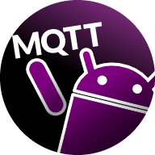
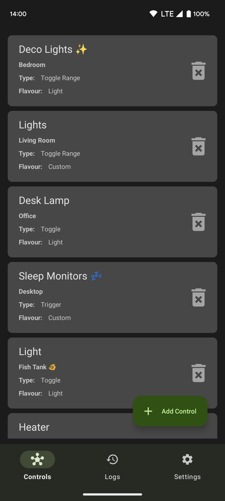
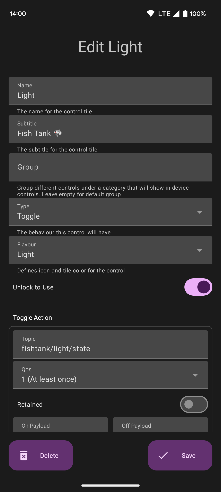
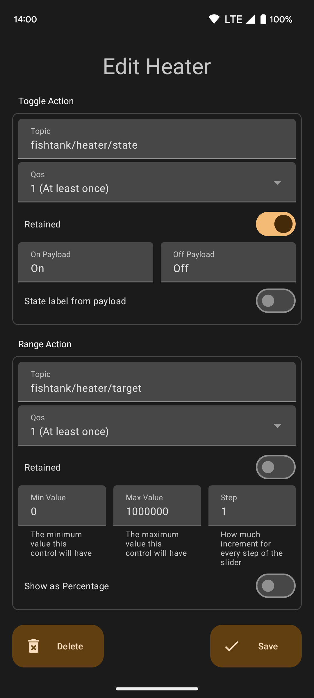
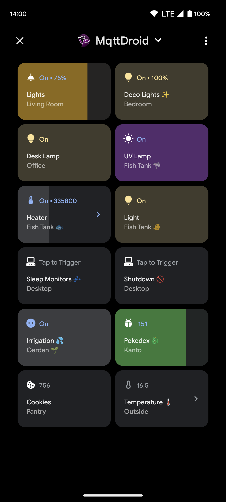

# MqttDroid 🤖📡

## Overview and Purpose
MqttDroid is an Android app that aims to provide MQTT support to Android's built-in [device controls](https://developer.android.com/develop/ui/views/device-control) (Android 11+).

It provides a friendly interface to create and edit custom devices with user-defined MQTT actions that will be usable in the device controls hub. Unlike other home automation apps, MqttDroid will connect directly to the MQTT broker, no special setup is needed.

**NOTE:** This app is **NOT** a standalone MQTT dashboard. It relies on Android's device controls to actually send and display MQTT messages.

*It was mainly tested on stock Android. Different vendors and Android flavors may have implemented device controls in a way that could make this app less straightforward to use or straight up useless.*

## ✨ Features
- Robust MQTT client based on [HiveMQ](https://github.com/hivemq/hivemq-mqtt-client)
- Supports these control types: **toggle**, **toggle with slider**, **range**, **trigger** and **gauge**
- One MQTT topic per control action, with separable pub / sub, QoS and retain support
- Customizable title, subtitle and group per control
- Customizable look and feel of each control tile (a range of stock Android flavors are offered. Alternatively, a custom icon and color can be chosen)
- Customizable toggle on / off payloads
- Customizable min, max, and step values for slider actions. Display as values or percentage
- Unlock to use can be set per control (only available on Android 13+)
- Live updates while on the device controls screen
- In-app log to check for recent MQTT activity
- A single broker with support for basic authentication
- Backup and restore all controls via a retained MQTT message on the broker
- Material You

## 📸 Screenshots

## May implement in the future 🧐
- ~~Separate pub / sub topics~~
- Thermostat control (two separate controls are needed as of now, one **toggle with slider** for settings and one **gauge** for readings)
- RGB control with color picker
- Multiple topics and payloads for triggers
- Offer a way to combine actions into a json payload targeted at a single topic
- Multiple brokers

## Libraries
- HiveMQ MQTT Client: https://github.com/hivemq/hivemq-mqtt-client
- Icon picker dialog: https://github.com/maltaisn/icondialoglib
- ColorPickerView: https://github.com/skydoves/ColorPickerView
- Google Gson: https://github.com/google/gson